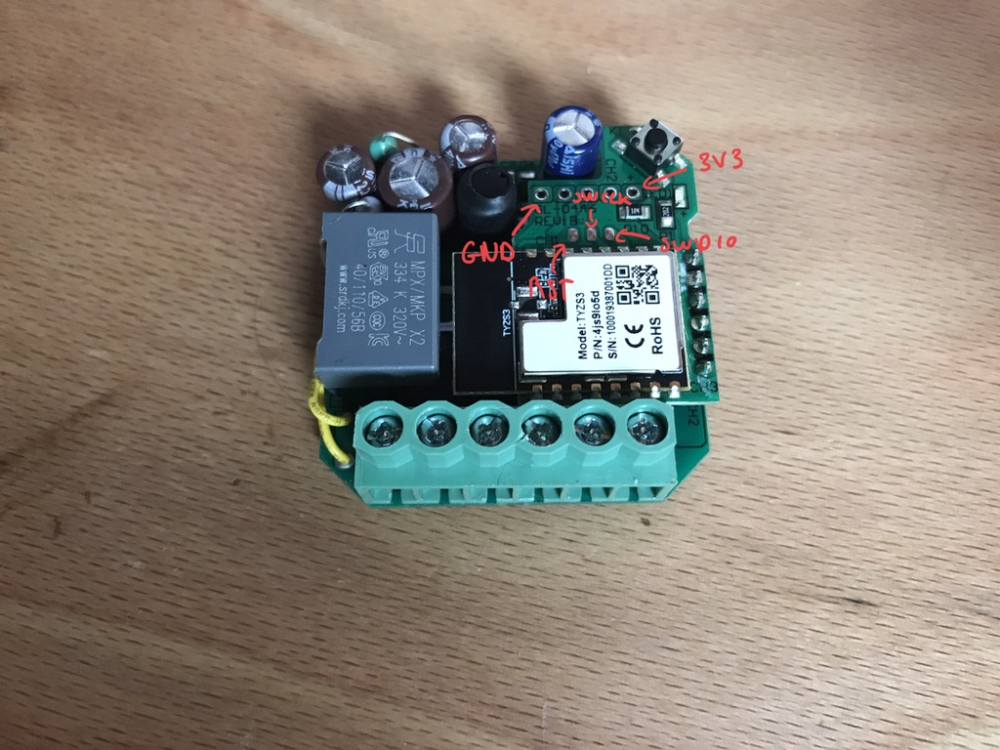
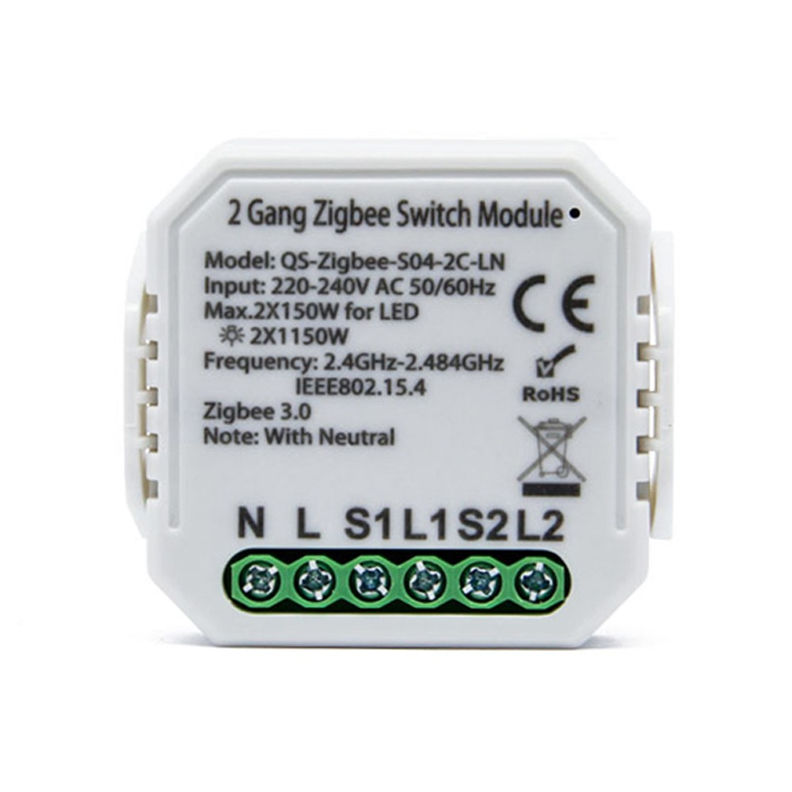

# efrurna

It's like espurna but for zigbee devices.

## Why efrurna ?

Because sometimes you would like more than the features embedded in original firmwares.

## Requirements

You need to install `gcc-arm-none-eabi` on your computer.

## Building

Just run

```sh
make
```

and built firmware will be located in `build/obj/efrurna.bin`.

## Flashing

Depending on your hardware you will need to locate the following pins : 3V, GND, SWDIO, SWDCK, NRST.

For instance on the `2 Gang Zigbee Switch Module`, after opening the box you will find the following PCB with the following pins :



It will require a little soldering but that should not be too complicated.

To flash I recommend using a STLINK V2 with the BlackMagic probe software https://github.com/blacksphere/blackmagic You can also flash with a Segger but it's more expensive.

To flash with blackmagic :

```sh
blackmagic build/obj/efrurna.bin
```

## Compatible hardware

All zigbee devices with the TYZS3 chip should be compatible.

The tested working hardware is as follows :

| Module Name | Picture | Notes |
|-------------|---------|-------|
| 2 Gang Zigbee Switch Module||Tested and working|